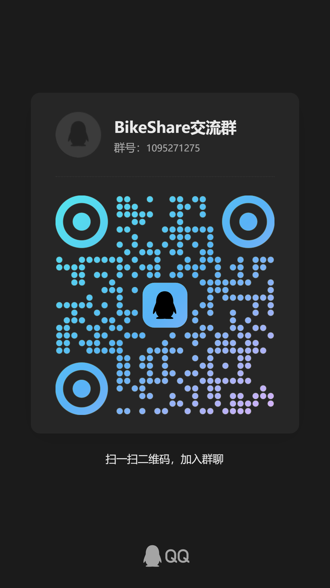

<div align="center">

# BikeShare 自行车租赁系统

</div>

<div align="center">

[](https://spring.io/projects/spring-boot)
[](https://vuejs.org/)
[](https://element-plus.org/)
[](https://www.mysql.com/)
[](https://redis.io/)
[](https://adoptium.net/)

<p>

[功能特性](#-功能特性) •
[技术架构](#-技术架构) •
[快速开始](#-快速开始) •
[部署指南](#-部署指南) •
[项目结构](#-项目结构)

</p>

</div>

---

<div align="center">

**🌐 官网地址**: [https://bikeshare.online](https://bikeshare.online) <br>

**🔧 后台管理**: [https://admin.bikeshare.online](https://admin.bikeshare.online) <br>

**📦 Gitee 仓库**: [https://gitee.com/loopeasen/bikelease](https://gitee.com/loopeasen/bikelease) <br>

**🐙 GitHub 仓库**: [https://github.com/yaoqianxu-ll/bikeshare](https://github.com/yaoqianxu-ll/bikeshare)

</div>

---

## 📋 项目概述

**BikeShare** 是一个功能完整的现代化自行车租赁系统，采用前后端分离架构设计。系统包含用户端展示界面和管理端后台系统，提供从车辆租赁到社交互动的完整解决方案。

### ✨ 项目亮点

- 🚴 **租车服务**: 车辆浏览、实时库存、在线租赁、计费扣费、订单管理
- 🔐 **安全可靠**: Spring Security + JWT 认证、BCrypt 密码加密、IP 限流黑名单
- ⚡ **高性能**: Redis 多级缓存、HikariCP 连接池、RabbitMQ 异步队列、分布式锁防超卖
- 💬 **实时通信**: WebSocket 实时聊天、RabbitMQ 异步消息处理
- 📝 **社区论坛**: 图文发帖、评论点赞、标签分类、管理员审核
- 🎪 **活动管理**: 骑行活动发布，省市区三级联动、RabbitMQ 报名队列、Redis 分布式锁防超卖、在线报名签到
- 🛒 **二手市场**: 物品发布、审核机制、多种交易方式
- 📊 **数据看板**: ECharts 可视化统计、实时数据监控
- 🎁 **积分VIP体系**: 积分获取/消耗/签到、VIP会员购买与兑换
- 🔔 **红点提醒**: 公告、活动、租赁、消息多维度未读提醒
- 🎨 **现代化 UI**: Element Plus 组件库、玻璃态设计、响应式布局，暗色模式
- 📧 **邮件通知**: RabbitMQ 队列化发送、QQ+163 双邮箱轮换、指数退避重试、私信/评论/系统多类型通知
- 🚀 **开箱即用**: Docker 一键部署、Jenkins CI/CD 自动构建、快速上线

## 🛠️ 技术架构

<table>
<tr>
<td valign="top" width="50%">

### 🔧 后端技术栈

- **核心框架**: Spring Boot 3.2.0
- **安全框架**: Spring Security 6.x + JWT
- **数据库**: MySQL 8.0 + MyBatis-Plus 3.5.5
- **缓存中间件**: Redis 7.0
- **消息队列**: RabbitMQ
- **文件存储**: MinIO 对象存储
- **实时通信**: Spring WebSocket
- **邮件服务**: Spring Mail + QQ/163 双邮箱轮换
- **工具库**:
  - Lombok (代码简化)
  - Hutool (Java 工具库)
  - Jackson (JSON 处理)

</td>
<td valign="top" width="50%">

### 🎨 前端技术栈

#### 用户端

- **核心框架**: Vue 3.4.0
- **构建工具**: Vite 5.0.8
- **UI 组件库**: Element Plus 2.5.0
- **状态管理**: Pinia 2.1.7
- **路由管理**: Vue Router 4.2.5
- **HTTP 客户端**: Axios 1.6.2
- **图表库**: ECharts 6.0.0
- **图标库**: Element Plus Icons

#### 管理端

- **数据可视化**: ECharts 5.x
- **省市区选择**: element-china-area-data

</td>
</tr>
</table>

## 📁 项目结构

```
bikelease/
├── script/                                         # 部署脚本和配置
│   ├── dev/                                       #   开发环境配置
│   └── prod/                                      #   生产环境配置
│       ├── docker-compose.yml                      #     Docker Compose 编排
│       └── nginx.conf                             #     Nginx 配置
│
├── bickdemo-backend/                              # 后端服务 (Spring Boot)
│   └── src/main/java/com/example/bickdemo/
│       ├── annotation/                             #   自定义注解
│       ├── aspect/                                #   AOP 切面 (IP 限流)
│       ├── component/                              #   组件 (MinIO 初始化)
│       ├── config/                                 #   配置类
│       │   ├── SecurityConfig                      #     Spring Security 配置
│       │   ├── CorsConfig                        #     跨域配置
│       │   ├── JwtAuthenticationFilter           #     JWT 认证过滤器
│       │   ├── IpAccessControlFilter             #     IP 访问控制
│       │   ├── ReadOnlyAdminFilter               #     只读管理员过滤
│       │   ├── WebSocketConfig                   #     WebSocket 配置
│       │   ├── MailSenderConfig                  #     双邮箱 MailSender 配置
│       │   ├── RabbitMqConfig                    #     RabbitMQ 队列配置 (报名队列 + 重试拦截器 + DLQ)
│       │   └── AsyncConfig                       #     异步线程池配置
│       ├── controller/                            #   REST API 控制器
│       │   ├── AuthController                    #     认证模块 (登录/注册)
│       │   ├── BicycleController                 #     车辆模块
│       │   ├── RentalController                  #     租赁模块
│       │   ├── ForumController                   #     论坛模块
│       │   ├── ActivityController                #     活动模块 (报名入队/签到/审核)
│       │   ├── SocialController                  #     社交模块
│       │   ├── TicketController                  #     工单模块
│       │   ├── MarketplaceController             #     二手市场模块
│       │   └── Admin*Controller                 #     管理端 API
│       ├── dto/                                   #   数据传输对象
│       │   └── ActivitySignupMessage.java       #    活动报名队列消息体
│       ├── entity/                                #   实体类
│       ├── exception/                            #   全局异常处理
│       ├── listener/                            #   事件监听器
│       │   ├── AdminNotificationListener.java  #     管理端通知监听器 (RabbitMQ → WebSocket)
│       │   ├── ActivitySignupConsumer.java     #     活动报名消费者 (分布式锁 + 防超卖 + 重试)
│       │   ├── EmailQueueListener.java         #     邮件队列消费者 (重试 + DLQ)
│       │   └── PointsListener.java             #     积分变动监听器
│       ├── mapper/                                #   MyBatis-Plus Mapper
│       ├── service/                               #   业务逻辑服务
│       │   ├── ActivityService.java            #     活动管理 + 报名/审核/签到（防超卖校验）
│       │   ├── ActivitySchedulerService.java   #     活动定时任务（自动发布/自动完成）
│       │   ├── AdminNotificationPublisher.java #     管理端通知发布服务
│       │   ├── UserEmailNotificationService.java #  用户邮件通知服务 (轮换 + 频控)
│       │   ├── UserNotificationService.java    #     用户消息中心通知服务
│       │   └── UnreadMessageEmailScheduler.java #   未读私信邮件提醒定时任务
│       └── util/                                  #   工具类
│
├── bickdemo-frontend/                           # 用户端前台 (Vue 3)
│   └── src/
│       ├── api/                                  #   API 接口封装
│       ├── components/                           #   可复用组件
│       │   ├── ThemeToggle.vue                  #     主题切换
│       │   ├── ImageUpload.vue                 #     图片上传
│       │   └── CitySelector.vue                #     城市选择器
│       ├── router/                               #   路由配置
│       ├── stores/                               #   Pinia 状态管理
│       │   ├── user.js                         #     用户状态
│       │   ├── theme.js                        #     主题状态
│       │   └── websocket.js                     #     WebSocket 状态
│       ├── styles/                              #   样式文件
│       └── views/                                #   页面组件
│
├── bickdemo-admin/                               # 管理端后台 (Vue 3)
│   └── src/
│       ├── api/                                 #   API 接口封装
│       ├── layouts/                             #   布局组件
│       │   └── AdminLayout.vue                 #     管理后台布局
│       ├── services/                           #   WebSocket 服务
│       │   └── notification.js                 #     通知服务 (STOMP)
│       ├── stores/                             #   Pinia 状态管理
│       │   ├── auth.js                        #     认证状态
│       │   └── notification.js                 #     通知状态
│       ├── components/                         #   公共组件
│       │   └── NotificationPanel.vue          #     通知面板组件
│       └── views/                              #   页面组件
│           ├── Dashboard.vue                    #     数据看板
│           ├── Users.vue                        #     用户管理
│           ├── Bicycles.vue                     #     车辆管理
│           ├── Rentals.vue                      #     租赁订单
│           ├── Activities.vue                   #     活动管理
│           ├── ForumModeration.vue              #     论坛审核
│           ├── Notices.vue                      #     公告管理
│           ├── Tickets.vue                      #     工单管理
│           ├── MarketplaceModeration.vue        #     市场审核
│           ├── Blacklist.vue                    #     黑名单管理
│           ├── LoginLogs.vue                    #     登录日志
│           ├── VisitorLogs.vue                  #     访客日志
│           └── OperationLogs.vue               #     操作日志
│
├── sql/                                          # 数据库脚本
│   └── init.sql                           #   完整数据库结构
│
└── README.md                                    # 项目文档
```

## ⭐ 功能特性

<table>
<tr>
<td valign="top" width="50%">

### 🚴 租车服务

- **车辆浏览**: 列表筛选、类型筛选、状态筛选
- **实时库存**: 库存数量实时显示
- **在线租赁**: 一键租车、实时计费
- **订单管理**: 租赁记录查询、费用明细
- **计费规则**: 支持按小时/按天计费
- **状态管理**: 可用/租用中/维护中等状态

### 👥 用户系统

- **多种登录**: 账号密码 + 邮箱验证码登录
- **权限管理**: 基于角色的访问控制 (USER/ADMIN)
- **安全防护**: JWT 认证 + Spring Security
- **邮件验证**: 注册验证码 + 密码重置，RabbitMQ 队列化发送
- **邮件通知**: 私信未读提醒、评论通知、系统公告、审核结果，同一用户 1 小时频控
- **个人资料**: 头像上传、简介编辑
- **会员等级**: 根据骑行时长计算会员等级

### 🎁 积分与VIP体系

- **积分获取**: 租车(+10)、发帖(+5)、活动参与(+15)、每日签到(+3)
- **积分消耗**: 积分兑换VIP月卡(500)/季卡(1200)/年卡(4000)
- **VIP购买**: 月卡¥9.9/季卡¥25/年卡¥88 现金购买
- **VIP权益**: 积分翻倍、专属客服、优先租赁热门车辆
- **签到功能**: 每日签到、Redis 24小时防刷

### 💬 社交聊天

- **好友管理**: 添加/删除/关注好友
- **好友申请**: 申请/接受/拒绝好友请求
- **实时聊天**: WebSocket 实时消息推送
- **离线消息**: 离线消息存储与推送
- **聊天记录**: 历史消息查询
- **消息类型**: 文本/图片/系统消息

### 📝 社区论坛

- **图文发帖**: 富文本编辑、多图上传
- **评论系统**: 二级评论、嵌套回复
- **互动功能**: 点赞/点踩 reactions
- **标签分类**: 标签筛选、热门话题
- **审核机制**: 管理员审核机制
- **内容管理**: 发布/编辑/删除帖子

</td>
<td valign="top" width="50%">

### 🎪 活动管理

- **活动发布**: 创建骑行活动、管理活动信息、自动定时发布
- **省市区选择**: 中国省市区三级联动选择器
- **报名队列**: RabbitMQ 异步报名入队，高并发场景下削峰填谷
- **防超卖机制**: Redis 分布式锁 + 三层防线（同步预检→消费者锁内校验→审核校验），精确计数 PENDING/APPROVED/SIGNED 状态
- **报名重试**: 消费失败自动重试 3 次（指数退避 1s→2s→4s），最终转入死信队列
- **签到管理**: 活动签到、签到统计、实时倒计时
- **审核通知**: 报名审核通过/拒绝自动推送消息中心系统通知
- **难度等级**: 简单/中等/困难三级难度
- **状态管理**: 草稿/已发布/进行中/已完成/已取消，进行中活动优先展示

### 🛒 二手市场

- **物品发布**: 发布闲置物品、图片描述
- **审核机制**: 管理员审核机制
- **交易方式**: 支持自提/快递/面交
- **联系卖家**: 内置联系功能
- **状态管理**: 可用/已售/已删除

### 🎫 工单系统

- **用户反馈**: 提交问题与建议
- **进度跟踪**: 工单状态跟踪
- **管理员处理**: 分配/回复/关闭工单
- **完整流程**: 待处理/处理中/已解决/已关闭

### 🔧 管理后台

- **数据看板**: ECharts 图表统计、实时数据
- **实时通知**: WebSocket 实时推送、RabbitMQ 异步处理、铃铛图标下拉面板
- **用户管理**: 用户列表、状态启用/禁用
- **车辆管理**: 车辆 CRUD、批量导入
- **订单管理**: 租赁订单查询、退款处理
- **活动管理**: 活动审核、报名审批（通过/拒绝）、签到管理、活动列表排序优化
- **论坛管理**: 帖子审核、评论管理
- **公告管理**: 系统公告发布与管理
- **黑名单管理**: IP 黑名单封禁
- **日志管理**: 登录日志、访问日志、操作日志

</td>
</tr>
</table>

## 🚀 快速开始

### 📋 环境要求

| 组件       | 版本要求   | 说明            |
| ---------- | ---------- | --------------- |
| ☕ JDK     | 17+       | 后端运行环境    |
| 🟢 Node.js | 18+       | 前端构建环境     |
| 🐬 MySQL   | 8.0+      | 主数据库        |
| 🔴 Redis   | 6.0+      | 缓存数据库      |
| 🐳 Docker  | 20.0+     | 容器化部署 (推荐) |

### 💾 数据库初始化

```bash
# 1. 创建数据库
mysql -u root -p
CREATE DATABASE bickdemo CHARACTER SET utf8mb4 COLLATE utf8mb4_unicode_ci;
EXIT;

# 2. 导入数据结构
mysql -u root -p bickdemo < sql/init.sql
```

> 💡 **提示**: 如果使用 Docker Compose 部署，数据库会自动初始化，无需手动执行以上步骤。

### 🔧 后端启动

```bash
# 克隆项目
git clone https://gitee.com/loopeasen/bikelease.git
cd bikelease/bickdemo-backend

# 配置数据库连接
# 编辑 src/main/resources/application.yml
# 修改数据库、Redis 等连接信息

# 启动后端
mvn spring-boot:run

# 或者使用 IDE 直接运行 BickdemoApplication.java
```

### 🎨 前端启动

```bash
# 用户端启动
cd bikelease/bickdemo-frontend
npm install
npm run dev
# 访问 http://localhost:5173

# 管理端启动 (新开终端)
cd bikelease/bickdemo-admin
npm install
npm run dev
# 访问 http://localhost:3000
```

### 🐳 Docker 部署（推荐）

```bash
# 克隆项目
git clone https://gitee.com/loopeasen/bikelease.git
cd bikelease

# 启动所有服务
docker compose up -d --build

# 查看服务状态
docker compose ps

# 查看日志
docker compose logs -f

# 停止服务
docker compose down -v
```

### 🌐 访问应用

| 应用        | 地址                    |
| ----------- |-----------------------|
| 🌐 用户端    | http://localhost5173  |
| 🔧 管理端    | http://localhost:3000 |
| 🔌 后端 API  | http://localhost:8080 |

## 🐳 部署指南

### 🔧 生产环境部署

#### 💻 服务器配置要求

**最低配置**：

- CPU: 2 核
- 内存：4GB
- 存储：20GB

**推荐配置**：

- CPU: 4 核
- 内存：8GB
- 带宽：5Mbps
- 存储：40GB SSD

#### 1️⃣ 环境准备

```bash
# 安装 Docker 和 Docker Compose
curl -fsSL https://get.docker.com -o get-docker.sh
sudo sh get-docker.sh

# 安装 Docker Compose
sudo curl -L "https://github.com/docker/compose/releases/download/v2.0.1/docker-compose-$(uname -s)-$(uname -m)" -o /usr/local/bin/docker-compose
sudo chmod +x /usr/local/bin/docker-compose
```

#### 2️⃣ 使用 Docker Compose 部署

```bash
# 克隆项目
git clone https://gitee.com/loopeasen/bikelease.git
cd bikelease

# 复制环境配置文件
cp script/prod/.env.example .env

# 根据生产环境修改 .env 文件中的配置
vim .env

# 启动所有服务
docker compose up -d --build
```

### 服务端口

| 服务       | 容器端口 | 说明          |
| ---------- | -------- | ------------- |
| 用户端      | 80, 443  | Nginx 用户端   |
| 管理端      | 80, 443   | Nginx 管理端   |
| 后端 API   | 8080     | Spring Boot   |
| MySQL     | 3306     | 数据库        |
| Redis     | 6379     | 缓存          |
| RabbitMQ  | 5672     | 消息队列       |

### 环境变量

| 变量名            | 默认值                  | 说明           |
| ----------------- | ---------------------- | -------------- |
| `MYSQL_HOST`      | localhost              | MySQL 主机     |
| `MYSQL_PORT`      | 3306                  | MySQL 端口     |
| `MYSQL_DATABASE`  | bickdemo              | 数据库名       |
| `MYSQL_USERNAME`  | root                  | MySQL 用户名   |
| `MYSQL_PASSWORD`  | -                     | MySQL 密码     |
| `JWT_SECRET`      | -                     | JWT 签名密钥   |
| `REDIS_HOST`      | localhost              | Redis 主机     |
| `REDIS_PORT`      | 6379                  | Redis 端口     |
| `MINIO_ENDPOINT`  | http://localhost:9000 | MinIO 端点     |
| `MINIO_ACCESS_KEY`| -                     | MinIO 访问密钥 |
| `MINIO_SECRET_KEY`| -                     | MinIO 密钥     |
| `MINIO_BUCKET`    | bicycles               | MinIO 存储桶   |
| `MAIL_HOST`       | smtp.qq.com            | 主邮箱 SMTP    |
| `MAIL_PORT`       | 587                    | 主邮箱端口      |
| `MAIL_USERNAME`   | -                      | 主邮箱账号      |
| `MAIL_PASSWORD`   | -                      | 主邮箱授权码    |
| `MAIL_SECONDARY_HOST`     | smtp.163.com   | 副邮箱 SMTP    |
| `MAIL_SECONDARY_PORT`     | 465            | 副邮箱端口      |
| `MAIL_SECONDARY_USERNAME` | -              | 副邮箱账号      |
| `MAIL_SECONDARY_PASSWORD` | -              | 副邮箱授权码    |

## 🔑 演示账号

| 角色      | 用户名 | 密码     | 说明                   |
| --------- | ------ | -------- | ---------------------- |
| 👑 管理员 | admin  | admin123 | 系统管理、审核、统计     |
| 🚴 用户   | user   | user123  | 租车、社交、发帖        |
| 👁️ 测试   | test   | 123456   | 只读权限，仅供查看数据   |

> ⚠️ **安全提醒**: 首次部署后请立即修改默认密码，生产环境务必使用强密码！

## 💬 QQ 交流群

<div align="center">

**群号**: 1095271275



</div>

## ❓ 常见问题

### Q: 数据库连接失败?

```bash
# 检查 MySQL 服务状态
mysql -u root -p -e "SELECT 1"

# 检查端口是否开放
netstat -an | grep 3306
```

### Q: 前端无法访问后端 API?

```bash
# 检查后端是否正常启动
curl http://localhost:8080/api/auth/me

# 检查跨域配置
cat bickdemo-backend/src/main/resources/application.yml
```

### Q: Redis 连接失败?

```bash
# 检查 Redis 服务
redis-cli ping
# 应返回: PONG
```

### Q: 如何重置数据库?

```bash
# 停止服务
docker compose down

# 删除数据卷(慎用!)
docker volume rm bikelease_mysql_data

# 重新初始化
docker compose up -d
mysql -u root -p bickdemo < sql/init.sql
```

## 🎨 UI 设计规范

### 玻璃态设计

项目多处使用玻璃态效果，提供现代化的视觉体验：

```css
/* 基础玻璃效果 */
backdrop-filter: blur(12px) saturate(180%);
background: rgba(255, 255, 255, 0.08);

/* 导航栏 */
.navbar {
  background: color-mix(in srgb, var(--bs-surface-solid) 88%, transparent);
  backdrop-filter: blur(12px) saturate(135%);
}

/* 主题切换按钮 */
.theme-toggle__button {
  border-radius: 999px;
  background: color-mix(in srgb, var(--bs-surface-solid) 88%, transparent);
  opacity: 0.95;
}
```

### 响应式断点

| 断点      | 屏幕宽度  | 布局效果           |
| --------- | --------- | ------------------ |
| 超小屏幕   | ≤480px   | 紧凑单列           |
| 手机端     | ≤768px   | 简化导航           |
| 平板      | ≤1050px  | 汉堡菜单模式        |
| 小屏PC    | ≤1300px  | 导航图标模式        |
| 大屏PC    | >1300px  | 完整导航           |

### 暗色模式

项目支持暗色模式切换，核心 CSS 变量：

```css
:root {
  --bs-bg: #ffffff;
  --bs-surface: #f8fafc;
  --bs-ink: #1e293b;
}

html.dark {
  --bs-bg: #0f172a;
  --bs-surface: #1e293b;
  --bs-ink: #f1f5f9;
}
```

## 📜 更新日志

### [v1.5.0] - 2026-06-10

- ✅ **RabbitMQ 报名队列**: 高并发场景下异步报名入队，削峰填谷，避免数据库瞬时压力
- ✅ **Redis 分布式锁防超卖**: 三层防线体系——同步预检（PENDING+APPROVED+SIGNED ≥ 上限快速拦截）、消费者锁内精确校验、审核通过前二次校验
- ✅ **报名消费重试**: 消费失败自动重试 3 次（指数退避 1s→2s→4s），最终转入死信队列兜底
- ✅ **锁释放安全校验**: Redis 锁释放前校验所有权，防止误删其他线程持有的锁
- ✅ **报名审核消息通知**: 审核通过/拒绝自动推送消息中心系统板块通知
- ✅ **活动详情页优化**: 实时倒计时、签到按钮、活动时间展示起止时间
- ✅ **活动状态按钮机**: 报名/审核中/已签到/名额已满等状态按钮样式联动
- ✅ **WebSocket 消息去重**: Layout 层全局消息去重，避免重复渲染
- ✅ **论坛 UI 重构**: 帖子列表与详情页交互优化
- ✅ **活动列表排序优化**: 进行中的活动优先展示，已完成活动降序排列
- ✅ **活动自动发布**: 定时任务自动将草稿状态活动发布，并发送通知邮件
- ✅ **管理端活动表格优化**: 签到时间纯文本展示、报名审核列对齐优化
- ✅ **按钮透明边框风格**: 操作区按钮改为淡色调透明边框样式，视觉更统一

### [v1.4.0] - 2026-06

- ✅ **消息中心**: 新增用户消息中心页面，聚合公告、评论、点赞、系统通知等
- ✅ **邮件通知系统**: RabbitMQ 队列化发送，单消费者串行处理，避免 SMTP 并发封禁
- ✅ **双邮箱轮换**: QQ + 163 双 SMTP 账号轮替发送，降低单账号限流风险
- ✅ **失败重试**: 指数退避重试 (5s/15s/30s)，死信队列 (DLQ) 兜底
- ✅ **通知类型**: 注册验证码、私信未读提醒、帖子评论通知、系统公告、审核结果
- ✅ **频控机制**: 同一发送者对同一用户 1 小时内最多推送 1 次
- ✅ **未读私信定时扫描**: 2 分钟周期扫描，超时未读自动邮件提醒
- ✅ **消息页面重构**: 微信风格全屏沉浸式聊天体验，好友与消息移至导航栏
- ✅ **帖子详情页**: 支持 `/forum/:id` 路由直接访问独立帖子页
- ✅ **VIP 积分兑换记录**: 新增兑换记录列表（用户端 + 管理端）
- ✅ **AI 流式输出优化**: 修复逐字输出失效问题，Markdown 渲染格式修复
- ✅ **管理员特权**: 管理员免限流/黑名单限制，租赁列表实时轮询
- ✅ **VIP 徽标**: 过期后显示暗色样式，订单记录支持分页查询

### [v1.3.0] - 2026-05

- ✅ **支付宝集成**: 支付宝沙箱支付对接，VIP 会员现金购买
- ✅ **VIP 续费与兑换**: 新增续费功能和积分兑换 VIP 功能
- ✅ **支付安全**: 修复表单转义验签失败、订单过期后仍可支付等问题
- ✅ **订单实时状态**: 支付倒计时过期实时更新，防止过期后误操作
- ✅ **部署优化**: Jenkins 环境文件优先级修复，env_file 显式指定

### [v1.2.0] - 2026-04

- ✅ **积分 VIP 体系**: 积分获取/消耗/签到、VIP 月卡/季卡/年卡购买与兑换
- ✅ **VIP 经验值**: 经验值成长体系，支持管理端调整，兼容旧版数据
- ✅ **AI 智能客服**: 基于硅基流动 API 的 AI 对话助手，悬浮按钮一键唤起
- ✅ **红点提醒**: 公告、活动、租赁、消息多维度未读红点提醒
- ✅ **消息撤回/重发**: 聊天消息右键菜单撤回，支持重新编辑发送
- ✅ **活动管理**: 报名截止功能、管理员留言回复、状态流程优化
- ✅ **工单系统**: 用户反馈提交、进度跟踪、满意度评价
- ✅ **管理端增强**: 公告管理、工单管理、活动管理、积分/会员管理页面
- ✅ **论坛增强**: 帖子内容展开折叠、评论审核功能
- ✅ **移动端适配**: 管理端响应式设计，抽屉式导航、表格自适应
- ✅ **管理端登录改造**: Naive UI 沉浸式玻璃卡片风格
- ✅ **N+1 查询优化**: 数据库查询性能优化，添加自行车热点缓存
- ✅ **头像裁剪**: 新增头像裁剪上传功能

### [v1.1.0] - 2026-03

- ✅ **管理端实时通知**: WebSocket + RabbitMQ 实时推送
- ✅ **通知类型**: 用户注册、IP黑名单、帖子/评论审核、挂牌审核
- ✅ **通知面板**: 铃铛图标、未读计数、下拉详情面板
- ✅ **通知持久化**: 数据库存储 + localStorage 隐藏状态
- ✅ **邮箱登录**: 邮箱验证码登录/注册，移除手机号字段
- ✅ **社交聊天**: 好友申请、WebSocket 实时聊天、已读状态、查看好友资料
- ✅ **论坛社区**: 图文发帖、评论、审核机制
- ✅ **车辆管理**: 增加车辆数量、租金实时展示
- ✅ **IP 黑名单**: IP 限流封禁功能
- ✅ **个人信息**: 头像上传、个人资料修改
- ✅ **SSL 部署**: HTTPS 证书配置
- ✅ **Jenkins CI/CD**: 自动化构建与部署流水线

### [v1.0.0] - 2026-03

- ✅ 项目初始化，前后端分离架构搭建
- ✅ 用户系统 (注册/登录/JWT 认证/Spring Security)
- ✅ 租车服务 (浏览/租用/归还/实时计费)
- ✅ 管理后台 (数据看板/用户/车辆管理)
- ✅ UI 玻璃态效果 + 暗色模式支持
- ✅ Docker Compose 一键部署

---

<div align="center">

**Built with ❤️ by BikeShare Team**


</div>
